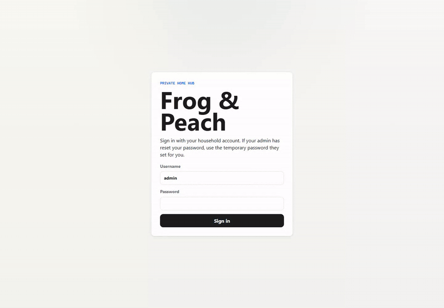
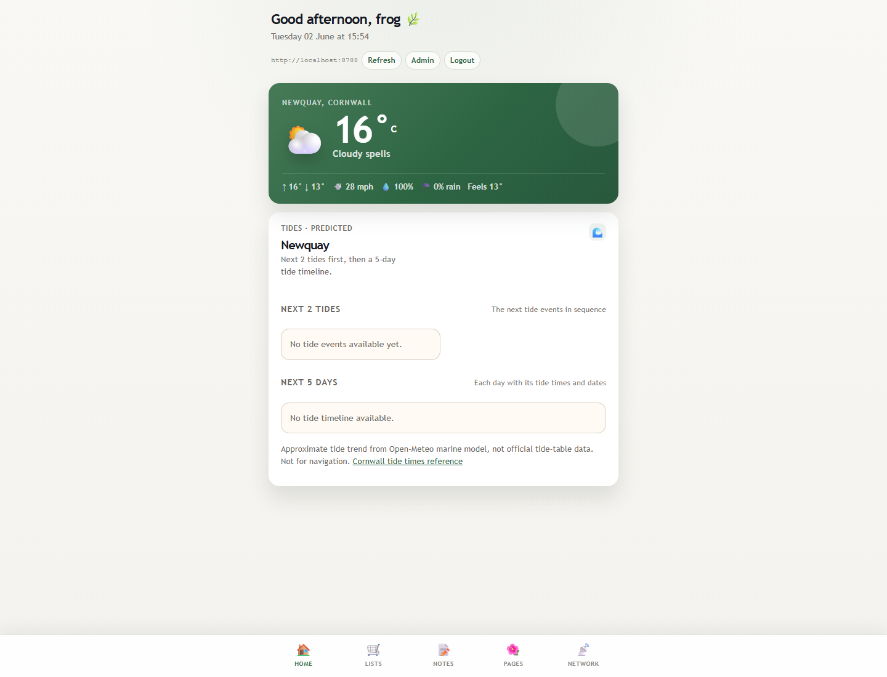
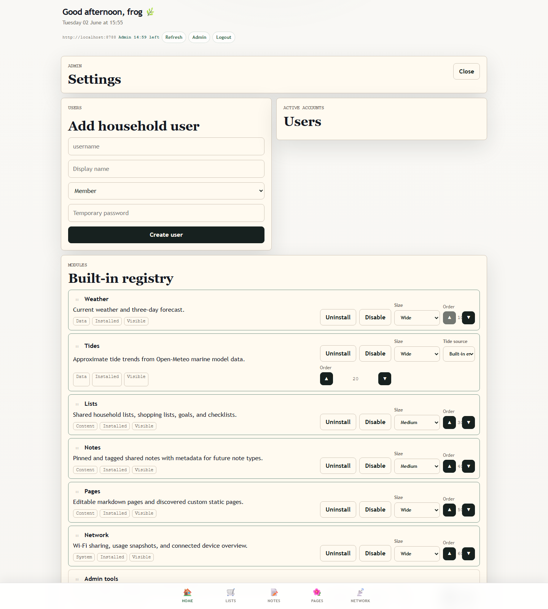

# Frog & Peach Home Hub

Frog & Peach is a private-by-default modular home hub built for Cloudflare Pages and D1, with a React/Vite frontend and Cloudflare Functions API.

## What It Includes

- Single-admin login for external hosting.
- Built-in modules for weather, tide trends, shopping lists, notes, editable markdown pages, static page launchers, settings, and deployment help.
- D1-backed persistence.
- Open-Meteo weather and marine data with local cache records.

## Screenshots

Captured locally with Playwright against the worker runtime.



| Home dashboard | Admin settings |
| --- | --- |
|  |  |

## Local Setup

```powershell
npm install
npm run hash-password -- "your-admin-password"
```

Create `.dev.vars`:

```text
ADMIN_USERNAME=admin
ADMIN_PASSWORD_HASH=pbkdf2_sha256$...
APP_ORIGIN=http://localhost:8788
SETUP_TOKEN=
```

Create and apply the local D1 database schema:

```powershell
npx wrangler d1 create frog-peach-db
npm run cf:migrate:local
```

Build the frontend and run the Cloudflare Pages emulator:

```powershell
npm run build
npm run dev:worker
```

Open `http://localhost:8788`. After login, the admin area is the root page at `/`.

On Windows you can use the included batch files:

- `build.bat` installs missing dependencies and builds the app.
- `run.bat` builds, then starts the full local app/API at `http://localhost:8788` and prints LAN URLs for phones/tablets on the same Wi-Fi.
- `start-test-site.bat` starts the quick Vite frontend-only test site at `http://localhost:5173`. Login and API features need `run.bat`.

If another device on the local network cannot connect to the printed LAN URL, check that Windows Firewall allows Node.js/Wrangler on private networks.

## Development

The Vite-only dev server can render the frontend quickly:

```powershell
npm run dev
```

API calls need `wrangler pages dev` because they depend on Cloudflare bindings.

## Deployment Notes

Set `APP_ORIGIN` to the deployed origin, for example `https://frog-peach-home-hub.pages.dev`. Set `SETUP_TOKEN` as a Cloudflare secret before first-run setup; production admin creation is blocked without it. Keep everything private unless you intentionally add public page behavior later.
