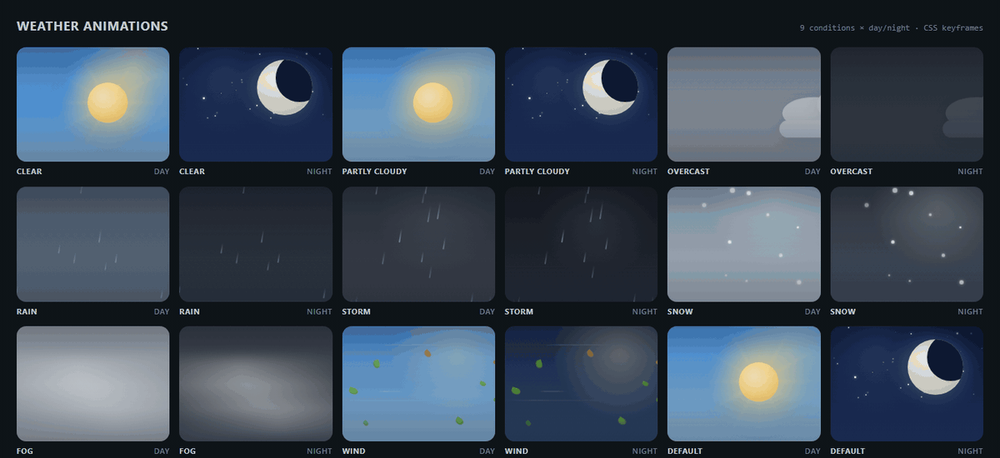
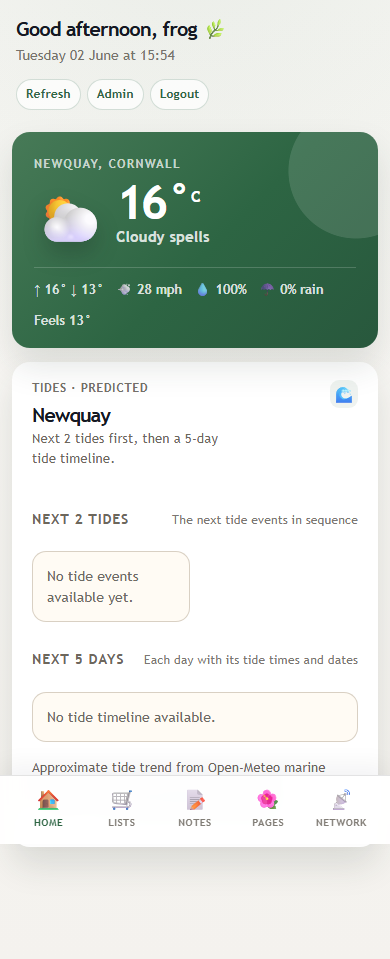
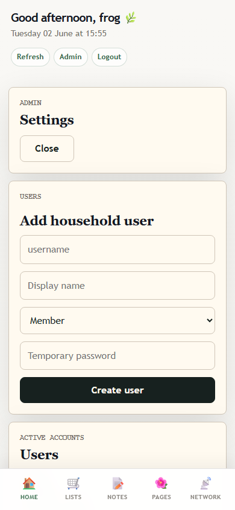

# Frog & Peach Home Hub

A private home dashboard for the stuff your household actually checks every day: weather, tides, shopping lists, notes, Wi-Fi details, and a few other things that keep a house running.

Built with React 19, TypeScript, Cloudflare Pages Functions, and D1.

## Preview



| Home dashboard | Admin settings |
| --- | --- |
|  |  |

| Home (mobile) | Admin (mobile) |
| --- | --- |
|  |  |

## Links

- Live app: `https://frog-peach-home-hub.pages.dev`
- GitHub Pages project site: `https://nofaniel.github.io/frogandpeach/`
- Cloudflare setup notes: [`docs/cloudflare-hosting.md`](docs/cloudflare-hosting.md)
- Project purpose notes: [`docs/project-purpose.md`](docs/project-purpose.md)

## What it does

- Dashboard of household modules you can show, hide, and reorder.
- Weather with 18 animated conditions (rain, snow, fog, wind, storms — each with day and night versions), hourly and five-day forecasts, wind, precipitation, and feels-like temperature.
- Tide data from Open-Meteo marine models — rising/falling state, next event, and a five-day timeline.
- Shared lists with starred items and scheduled clearing (daily, weekly, monthly, goal-based).
- Tagged markdown notes for reminders, handovers, and the small details people forget.
- Custom pages for household guides, local links, and static content.
- Wi-Fi sharing with QR codes, router links, and device info.
- Admin tools for user accounts, module control, theming, and caching.
- JSON-based themes with optional CSS — no-flash loading via a snapshot stored in localStorage.

## Tech stack

- Frontend: React 19, TypeScript, Vite
- Backend: Cloudflare Pages Functions (Workers runtime)
- Database: Cloudflare D1 / SQLite
- Tests: Vitest (unit), Playwright (E2E)

## Repository layout

| Path | Purpose |
| --- | --- |
| `src/App.tsx` | Main app shell, state, and navigation |
| `src/api/` | API routing, auth, D1 access, module definitions |
| `src/shared/` | Shared API types |
| `src/theme/` | Runtime theme loading and token handling |
| `themes/` | Source theme folders |
| `public/themes/` | Synced theme output used by the app |
| `functions/` | Cloudflare Pages Function entry points and middleware |
| `migrations/` | D1 SQL migrations |
| `e2e/` | Playwright E2E tests |
| `docs/` | Project notes and README screenshots |

## Local setup

Install dependencies:

```powershell
npm install
```

Create local secrets:

```powershell
Copy-Item .env.example .dev.vars
npm run hash-password -- "your-admin-password"
```

Set the generated password hash in `.dev.vars`:

```text
ADMIN_USERNAME=admin
ADMIN_PASSWORD_HASH=pbkdf2_sha256$...
APP_ORIGIN=http://localhost:8788
SETUP_TOKEN=
SESSION_TTL_DAYS=14
```

Apply local D1 migrations:

```powershell
npm run cf:migrate:local
```

Build and run the full local app:

```powershell
npm run build
npm run dev:worker
```

Open `http://localhost:8788`.

## Development

Frontend-only Vite server (no API):

```powershell
npm run dev
```

Runs on `http://localhost:5173`. API calls will 404 in this mode.

Full Cloudflare Pages runtime:

```powershell
npm run build
npm run dev:worker
```

Runs on `http://localhost:8788` — use this for auth, API, and D1 work.

## Tests

Unit tests:

```powershell
npm test
```

E2E tests against a live local instance:

```powershell
$env:E2E_BASE_URL = "http://localhost:8788"
$env:TEST_USERNAME = "admin"
$env:TEST_PASSWORD = "your-admin-password"
npm run test:e2e
```

E2E tests mutate D1 data. Don't point them at production.

## Database

Apply migrations locally:

```powershell
npm run cf:migrate:local
```

Apply migrations remotely:

```powershell
npm run cf:migrate:remote
```

Local D1 state is managed by Wrangler and isn't committed.

## Deployment

Deploy the Cloudflare Pages app:

```powershell
npm run cf:deploy
```

Run remote migrations separately when new migration files have been added:

```powershell
npm run cf:migrate:remote
```

The GitHub Pages project site deploys from `.github/workflows/gh-pages.yml` when files under `gh-pages-site/` change on `main`.

## CI

GitHub Actions runs:

1. `npm test`
2. `npm run build`

Playwright E2E tests are not run in CI.
